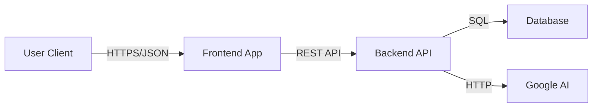

# Magic Tasks Technical Documentation

> **Version**: 1.0.0
> **Status**: Production Ready
> **Maintainer**: Caio Henrique (Caayu)

## 📚 Table of Contents

1.  [Executive Summary](#executive-summary)
2.  [System Architecture](#system-architecture)
3.  [Technology Stack](#technology-stack)
4.  [Project Structure](#project-structure)
5.  [Backend Engineering (NestJS)](#backend-engineering)
6.  [Frontend Engineering (Next.js)](#frontend-engineering)
7.  [Artificial Intelligence Integration](#ai-integration)
8.  [Database Design](#database-design)
9.  [Security & Compliance](#security)
10. [DevOps & Infrastructure](#devops)
11. [Setup & Installation](#setup)

---

## 1. Executive Summary <a name="executive-summary"></a>

**Magic Tasks** is an enterprise-grade task management solution designed to demonstrate the convergence of Modern Web Development patterns, Clean Architecture principles, and Generative AI. It allows users to manage tasks with high efficiency, utilizing Large Language Models (LLMs) to automate task creation, categorization, and breakdown.

The system is built as a **Monorepo**, ensuring code sharing and type safety across the entire stack, from the database schema to the frontend UI components.

---

## 2. System Architecture <a name="system-architecture"></a>

The application follows a **Hexagonal Architecture** (Ports and Adapters) on the backend and a **Component-Based Architecture** on the frontend.

### High-Level Diagrams

**Data Flow:**



**Security boundaries:**

- All external input is sanitized at the API Gateway level (NestJS Pipes).
- Database access is strictly controlled via Repository interfaces.
- AI prompts are isolated to prevent injection attacks.

---

## 3. Technology Stack <a name="technology-stack"></a>

We have selected industry-standard, high-performance tools for this project:

| Category       | Technology        | Rationale                                              |
| :------------- | :---------------- | :----------------------------------------------------- |
| **Language**   | TypeScript 5.x    | Strict typing ensures safety at compile time.          |
| **Monorepo**   | Turborepo         | High-performance build system with caching.            |
| **Backend**    | NestJS            | Modular, scalable, and testable Node.js framework.     |
| **Frontend**   | Next.js 16        | Server-Side Rendering (SSR) for SEO and performance.   |
| **Database**   | SQLite + Drizzle  | Zero-latency, highly portable, type-safe SQL queries.  |
| **AI**         | Gemini Flash      | Cost-effective, low-latency LLM with native JSON mode. |
| **State**      | React Query       | Server state management with optimistic UI updates.    |
| **Styling**    | Tailwind + Shadcn | Accessible, composable, and themeable UI components.   |
| **Validation** | Zod               | Runtime schema validation shared across full stack.    |

---

## 4. Project Structure <a name="project-structure"></a>

The codebase is organized to maximize separation of concerns:

```text
.
├── apps
│   ├── api              # NestJS Backend Application
│   │   ├── src
│   │   │   ├── ai       # AI Module (Gemini Integration)
│   │   │   ├── tasks    # Tasks Domain (Clean Architecture)
│   │   │   └── common   # Shared filters, guards, and interceptors
│   │   └── test         # E2E Tests
│   └── web              # Next.js Frontend Application
│       ├── app          # App Router (Pages & Layouts)
│       ├── components   # React Components
│       ├── lib          # API Clients & Utilities
│       └── messages     # i18n Translation Files
├── packages
│   ├── shared           # Shared Types, DTOs, and Enums
│   ├── ui               # Shared React UI Components (Stub)
│   ├── eslint-config    # Shared Linting Rules
│   └── typescript-config # Shared TSConfig
└── docker-compose.yml   # Infrastructure Orchestration
```

---

## 5. Backend Engineering (NestJS) <a name="backend-engineering"></a>

The backend is the core of the business logic. It allows no leakage of infrastructure details into the domain.

### 5.1 Domain Entities (Rich Model)

We avoid "Anemic Domain Models". Our entities enforce invariants.

```typescript
// Task Entity ensures a task cannot be completed twice
public complete(): void {
  if (this.props.isCompleted) throw new TaskAlreadyCompletedError();
  this.props.isCompleted = true;
}
```

### 5.2 Use Cases (Application Services)

Controllers are "dumb". They only translate HTTP requests into Use Case executions.

```typescript
// CreateTaskUseCase
async execute(dto: CreateTaskDto): Promise<Task> {
  const task = Task.create(dto.title, ...);
  await this.taskRepository.save(task);
  return task;
}
```

### 5.3 Error Handling

We use a **Domain Error Registry** pattern. Domain logic throws pure `Errors` (e.g., `TaskNotFoundError`). A global Exception Filter maps these to HTTP 404/400/500 automatically.

---

## 6. Frontend Engineering (Next.js) <a name="frontend-engineering"></a>

### 6.1 Server Components & SEO

We leverage Next.js App Router. Metadata is generated dynamically on the server based on the task data, ensuring rich previews on social media.

### 6.2 Internationalization (i18n)

The app is fully localized in English (`en`), Portuguese (`pt`), and Spanish (`es`).

- **Middleware** detects `Accept-Language` headers.
- **Routing** handles language prefixes (`/pt/tasks`).

### 6.3 Optimistic UI

Using React Query, we update the UI _instantly_ when a user creates or modifies a task, providing a "magic" feel, while syncing with the server in the background.

---

## 7. Artificial Intelligence Integration <a name="ai-integration"></a>

The "Magic" in Magic Tasks comes from the `AiModule`. We specifically selected **Gemini Flash Latest** for this implementation due to:

1.  **Cost Efficiency**: It offers a generous **Free Tier**, making it accessible for developers and personal projects without upfront costs.
2.  **Low Latency**: As a "Flash" model, it is optimized for high-speed inference, essential for maintaining a responsive user experience (sub-second generation).
3.  **JSON Capabilities**: Superior adherence to strict JSON schemas compared to other models in its class.

### 7.1 Prompt Engineering Strategy

We use **System Instructions** and **One-Shot Learning** (via schema definition) to ensure the AI behaves deterministically.

### 7.2 Safety Mechanisms

- **Output Validation**: The raw output from Gemini is parsed and validated against a Zod Schema. If the AI hallucinates an invalid field, the system rejects it before it reaches the frontend.
- **Prompt Injection Defense**: User input is wrapped in XML tags, isolating it from system instructions.

---

## 8. Database Design <a name="database-design"></a>

We use **Drizzle ORM** for its minimal overhead and TypeScript integration.

### Schema: `tasks` table

| Column         | Type    | Constraints | Description          |
| :------------- | :------ | :---------- | :------------------- | -------- |
| `id`           | TEXT    | PRIMARY KEY | UUID v4              |
| `title`        | TEXT    | NOT NULL    | Task title           |
| `description`  | TEXT    | NULLABLE    | Detailed description |
| `is_completed` | INTEGER | DEFAULT 0   | Boolean flag (0/1)   |
| `limit_date`   | INTEGER | NULLABLE    | UNIX Timestamp       |
| `priority`     | TEXT    | ENUM        | LOW, MEDIUM, HIGH    | CRITICAL |

---

## 9. Security & Compliance <a name="security"></a>

Security is implemented in layers (Defense in Depth).

1.  **Transport Layer**: All communications forced over standard HTTP methods.
2.  **Application Layer**:
    - **Throttling**: Rate limiting set to 10 requests/minute.
    - **Payload Size**: Max 10kb body size to prevent DoS.
3.  **Data Layer**:
    - **Sanitization**: `sanitize-html` strips malicious scripts from inputs.
    - **Parameterization**: Drizzle ORM prevents SQL Injection by design.

---

## 10. DevOps & Infrastructure <a name="devops"></a>

### Docker Strategy

- **Development**: `docker-compose.yml` mounts local volumes for hot-reloading.
- **Production**: `docker-compose.prod.yml` uses multi-stage builds.
  - **Turbo Prune**: Analyses the dependency graph and copies _only_ the packages needed for the specific app (`api` or `web`), significantly reducing image size.

---

## 11. Setup & Installation <a name="setup"></a>

### Prerequisites

- Docker Engine 24+
- OR Node.js 20+ and pnpm 10+

### Quick Start (Docker)

```bash
# 1. Clone the repository
git clone https://github.com/Caayu/sinky-challenge.git

# 2. Start the stack
docker compose up
```

### Manual Start (Local)

```bash
# 1. Install dependencies
pnpm install

# 2. Initialize Database
cd apps/api
pnpm db:push
cd ../..

# 3. specific dev run
pnpm run dev
```
